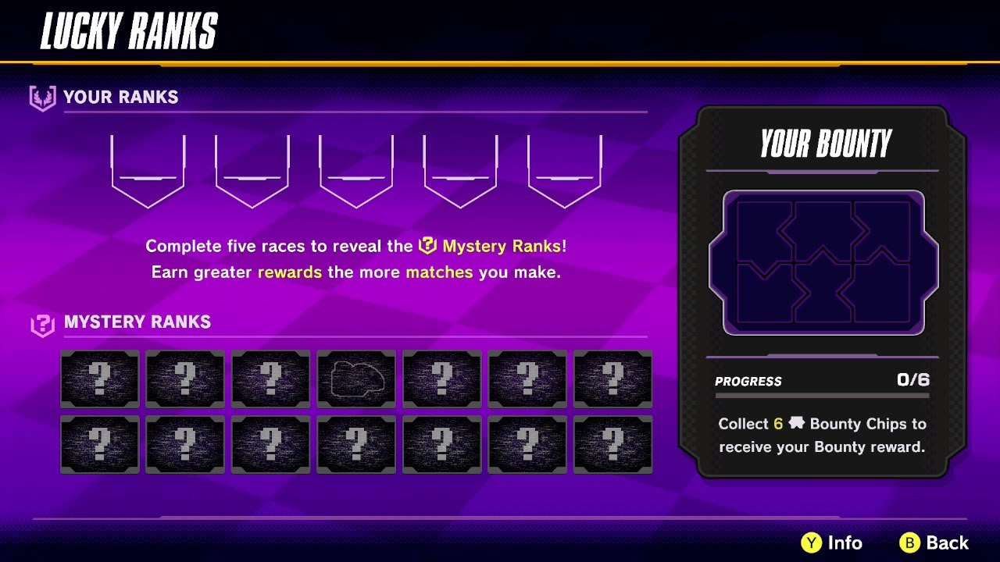
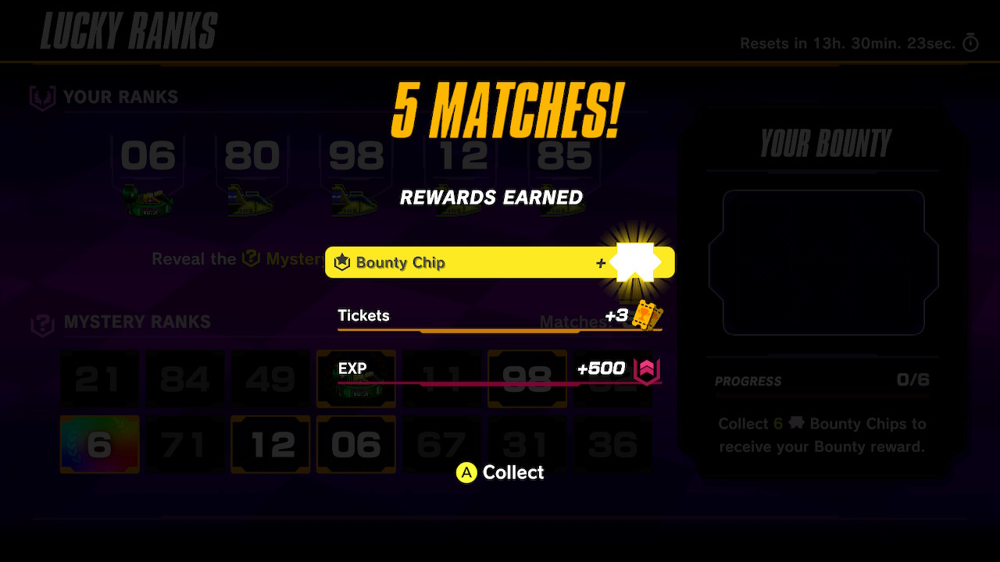

# Intro

This project is meant for me to practice go concepts while simulating an interesting question posed by my favorite game at the moment.

## Golang

I know Go's main use cases range from APIs, and CLIs, but my background is in testing and DevOps, so I went for a familiar scripting approach for the project while I acclimated to the language. I got to play around types, structs, interfaces, loops and ranges, casting, fixed-length arrays, testing, and print formatting. This project was worth my time.

## The Game

On Nov. 28 2023, F-Zero 99 updated to include a new **lucky ranks** feature. Your placements in the first five races in a day would be compared 14 mystery cards, revealed to the player after they had completed their placements. If a player uncovered 5 matches from revealed cards, that player would receive an unlockable cosmetic border for their player card, viewable by other players.

There are three types of mystery cards. There are 99 Placement cards (for each possible placement), as well as Machine Cards for all four machines, and Wild Cards for each digit. To optimize your ranks for the minigame, a player will want to collect as many unique digits as possible to guarantee as many matches any WildCards the game could deal for that day. Machine Cards are revealed to the player before they complete their ranks, and a player can obtain any placement any machine. Placement cards are all unique, and by looking for new wildcard digits, a player should have unique ranks to match against anyway.

The matching strategy is easy to optimize, but I wanted to know how likely a player was receive 5 matches while trying to place optimally. For reference, here's what the game looks like. And here's a screenshot from when I got lucky on Jan. 1 2024.

Before Reveal | My 5 Matches
------------- | ------------
 | 

# The Question

So, how likely is it for a player to receive 5 matches while trying to place optimally? Let's make some assumptions. I have to assume that all possible placements, machines, and wildcards exist once each in the deck from which the game draws it's mystery cards. Let's also assume the player will obtain 5 unique placements as well.

How many possibilities are there for different matches? How much will a player's chances vary if they fail to obtain unique placement digits? Machine cards are revealed before the player locks in their placements-- how would seeing machine cards improve the players chance of getting 5 matches?

# Random Selection for an Answer

I never intended to use pure math to solve this problem, although that's probably the fastest way to do it. Iterating through every posibility would be `(112 choose 14) * (99 choose 5)` iterations-- way too many. To make an approximation, I chose to randomly sample 50 million combinations.

## Takeaways
Unsurprisingly, the odds seemed to be really low. Overall, even if a player placed optimally to cover as many wildcards as possible, they only had a `1%` chance each day to acheive 5 matches. A player would need to place optimally for ``70 days`` in a row to have a 50% chance of being dealt 5 matches at least once. Luckily for me, I managed to snag my badge in `35 days`!

### Machine Cards
A player is more likely not to be dealt a single machine card, but each card dealt will help immensely. If a player receives 2 machine cards, their chances go up dramatically-- Almost to the point of hopelessness if a player doesn't receive one.

```
8 unique digits, 0 machine cards:        2219 matches,   1401140 misses.    1403359 sum, 0.16%
8 unique digits, 1 machine cards:        7247 matches,    819175 misses.     826422 sum, 0.88%
8 unique digits, 2 machine cards:        6184 matches,    161210 misses.     167394 sum, 3.84%

9 unique digits, 0 machine cards:         195 matches,     67776 misses.      67971 sum, 0.29%
9 unique digits, 1 machine cards:         503 matches,     39271 misses.      39774 sum, 1.28%
9 unique digits, 2 machine cards:         412 matches,      7737 misses.       8149 sum, 5.33%
```

### Unique Digits
Surprisingly, when a player controls their placements to cover as many wildcards as possible, their chance of getting 5 matches rises exponentially, around `145%` for each digit covered.
```
6 unique digits:       67974 matches,  20064782 misses.   20132756 sum, 0.34%
7 unique digits:       60577 matches,  11919946 misses.   11980523 sum, 0.51%
8 unique digits:       17558 matches,   2393941 misses.    2411499 sum, 0.73%
9 unique digits:        1225 matches,    115369 misses.     116594 sum, 1.06%
```

## Program Output
```
2 unique digits, 0 machine cards:           0 matches,       884 misses.        884 sum, 0.00%
2 unique digits, 1 machine cards:           0 matches,       506 misses.        506 sum, 0.00%
2 unique digits, 2 machine cards:           0 matches,       123 misses.        123 sum, 0.00%
2 unique digits, 3 machine cards:           0 matches,         2 misses.          2 sum, 0.00%
2 unique digits, 4 machine cards:           0 matches,         0 misses.          0 sum, NaN%

3 unique digits, 0 machine cards:           4 matches,     96602 misses.      96606 sum, 0.00%
3 unique digits, 1 machine cards:          31 matches,     57243 misses.      57274 sum, 0.05%
3 unique digits, 2 machine cards:          72 matches,     11529 misses.      11601 sum, 0.62%
3 unique digits, 3 machine cards:          28 matches,       933 misses.        961 sum, 3.00%
3 unique digits, 4 machine cards:           3 matches,        30 misses.         33 sum, 10.00%

4 unique digits, 0 machine cards:         164 matches,   1580834 misses.    1580998 sum, 0.01%
4 unique digits, 1 machine cards:        1006 matches,    928524 misses.     929530 sum, 0.11%
4 unique digits, 2 machine cards:        1583 matches,    187443 misses.     189026 sum, 0.84%
4 unique digits, 3 machine cards:         753 matches,     14996 misses.      15749 sum, 5.02%
4 unique digits, 4 machine cards:         109 matches,       330 misses.        439 sum, 33.03%

5 unique digits, 0 machine cards:        1787 matches,   7253819 misses.    7255606 sum, 0.02%
5 unique digits, 1 machine cards:        8815 matches,   4267916 misses.    4276731 sum, 0.21%
5 unique digits, 2 machine cards:       11544 matches,    857473 misses.     869017 sum, 1.35%
5 unique digits, 3 machine cards:        4651 matches,     66819 misses.      71470 sum, 6.96%
5 unique digits, 4 machine cards:         482 matches,      1590 misses.       2072 sum, 30.31%

6 unique digits, 0 machine cards:        5992 matches,  11703105 misses.   11709097 sum, 0.05%
6 unique digits, 1 machine cards:       24523 matches,   6875224 misses.    6899747 sum, 0.36%
6 unique digits, 2 machine cards:       27248 matches,   1377615 misses.    1404863 sum, 1.98%
6 unique digits, 3 machine cards:        9319 matches,    106473 misses.     115792 sum, 8.75%
6 unique digits, 4 machine cards:         892 matches,      2365 misses.       3257 sum, 37.72%

7 unique digits, 0 machine cards:        6678 matches,   6958628 misses.    6965306 sum, 0.10%
7 unique digits, 1 machine cards:       23253 matches,   4085913 misses.    4109166 sum, 0.57%
7 unique digits, 2 machine cards:       22748 matches,    812431 misses.     835179 sum, 2.80%
7 unique digits, 3 machine cards:        7296 matches,     61683 misses.      68979 sum, 11.83%
7 unique digits, 4 machine cards:         602 matches,      1291 misses.       1893 sum, 46.63%

8 unique digits, 0 machine cards:        2219 matches,   1401140 misses.    1403359 sum, 0.16%
8 unique digits, 1 machine cards:        7247 matches,    819175 misses.     826422 sum, 0.88%
8 unique digits, 2 machine cards:        6184 matches,    161210 misses.     167394 sum, 3.84%
8 unique digits, 3 machine cards:        1779 matches,     12151 misses.      13930 sum, 14.64%
8 unique digits, 4 machine cards:         129 matches,       265 misses.        394 sum, 48.68%

9 unique digits, 0 machine cards:         195 matches,     67776 misses.      67971 sum, 0.29%
9 unique digits, 1 machine cards:         503 matches,     39271 misses.      39774 sum, 1.28%
9 unique digits, 2 machine cards:         412 matches,      7737 misses.       8149 sum, 5.33%
9 unique digits, 3 machine cards:         109 matches,       574 misses.        683 sum, 18.99%
9 unique digits, 4 machine cards:           6 matches,        11 misses.         17 sum, 54.55%


2 unique digits:           0 matches,      1515 misses.       1515 sum, 0.00%
3 unique digits:         138 matches,    166337 misses.     166475 sum, 0.08%
4 unique digits:        3615 matches,   2712127 misses.    2715742 sum, 0.13%
5 unique digits:       27279 matches,  12447617 misses.   12474896 sum, 0.22%
6 unique digits:       67974 matches,  20064782 misses.   20132756 sum, 0.34%
7 unique digits:       60577 matches,  11919946 misses.   11980523 sum, 0.51%
8 unique digits:       17558 matches,   2393941 misses.    2411499 sum, 0.73%
9 unique digits:        1225 matches,    115369 misses.     116594 sum, 1.06%

0 machine cards:       17039 matches,  29062788 misses.   29079827 sum, 0.06%
1 machine cards:       65378 matches,  17073772 misses.   17139150 sum, 0.38%
2 machine cards:       69791 matches,   3415561 misses.    3485352 sum, 2.04%
3 machine cards:       23935 matches,    263631 misses.     287566 sum, 9.08%
4 machine cards:        2223 matches,      5882 misses.       8105 sum, 37.79%

In total:      178366 matches,  49821634 misses.   50000000 sum, 0.36%
```
